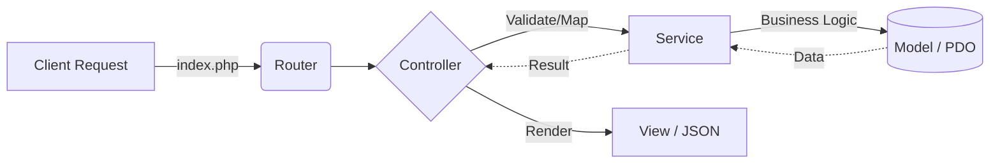

<div align="center">

# 🔮 Chuỗi Ngọc – E-commerce Trang Sức Phong Thủy
**Hệ thống Website Thương Mại Điện Tử chuyên biệt cho trang sức phong thủy, đá quý.**
*Thiết kế hiện đại · Quản trị toàn diện · Trải nghiệm mượt mà*


</div>

---

## 📋 Mục Lục

- [🌟 Giới Thiệu](#-giới-thiệu)
- [✨ Tính Năng Nổi Bật](#-tính-năng-nổi-bật)
- [🛠️ Công Nghệ Sử Dụng](#️-công-nghệ-sử-dụng)
- [🏗️ Kiến Trúc Hệ Thống (Custom MVC)](#️-kiến-trúc-hệ-thống-custom-mvc)
- [📂 Cấu Trúc Thư Mục](#-cấu-trúc-thư-mục)
- [🚀 Hướng Dẫn Cài Đặt](#-hướng-dẫn-cài-đặt)
- [🔑 Thông Tin Demo](#-thông-tin-demo)
- [🤝 Đóng Góp Phát Triển](#-đóng-góp-phát-triển)

---

## 🌟 Giới Thiệu

**Chuỗi Ngọc** là dự án Website thương mại điện tử chuyên cung cấp các sản phẩm trang sức đá quý, vòng tay phong thủy và chuỗi hạt. Dự án được xây dựng từ đầu (from scratch) hoàn toàn bằng **PHP thuần** kết hợp mô hình **Custom MVC**, không phụ thuộc vào bất kỳ framework PHP nào (như Laravel hay CodeIgniter). 

Dự án không chỉ là một trang web bán hàng thông thường mà còn tích hợp các tính năng **tư vấn phong thủy (Ngũ hành bản mệnh)**, hệ thống **quản lý kho bãi chuyên sâu** và **hệ thống khuyến mãi phức tạp** dành cho khách hàng thành viên.

---

## ✨ Tính Năng Nổi Bật

Hệ thống được chia làm 2 phân hệ rõ ràng với các tính năng chuyên biệt:

### 🛍️ Phân Hệ Khách Hàng (User)
Giao diện được tối ưu hóa UI/UX với TailwindCSS v4, mang lại trải nghiệm mua sắm mượt mà:
- **Tư vấn phong thủy:** Gợi ý sản phẩm phù hợp dựa trên cung mệnh (Kim, Mộc, Thủy, Hỏa, Thổ) và loại đá quý.
- **Trải nghiệm mua sắm:** Tìm kiếm nâng cao, lọc đa tiêu chí (mức giá, loại đá, mệnh), sắp xếp linh hoạt.
- **Chi tiết sản phẩm:** Hỗ trợ biến thể (màu sắc, kích thước), thư viện ảnh (gallery), hiển thị số lượng tồn kho realtime.
- **Khuyến mãi & Hội viên:** Tích hợp Flash Sale, lưu Voucher vào ví (AJAX), ưu đãi tự động dựa trên 4 hạng thành viên (Đồng, Bạc, Vàng, Kim Cương).
- **Quản lý cá nhân:** Tra cứu đơn hàng, danh sách yêu thích (Wishlist), sổ địa chỉ (Address), lịch sử đánh giá sản phẩm.
- **Blog Kiến thức:** Bài viết chia sẻ kiến thức phong thủy, bảo quản trang sức.

### ⚙️ Phân Hệ Quản Trị (Admin Panel)
Hệ thống quản trị (ERP thu nhỏ) giúp kiểm soát toàn bộ vòng đời sản phẩm và doanh nghiệp:
- **Dashboard Thống Kê:** Trực quan hóa dữ liệu bằng Chart.js (Doanh thu, đơn hàng, khách hàng mới).
- **Quản Lý Bán Hàng:** Xử lý đơn hàng, theo dõi trạng thái vận chuyển, in hóa đơn.
- **Quản Lý Kho Chuyên Sâu:** 
  - Nhập kho, Xuất kho, Thuyên chuyển kho nội bộ.
  - Kiểm kê định kỳ, phân quyền khu vực kho.
  - Quản lý nhà cung cấp.
- **Quản Lý Sản Phẩm & Master Data:** CRUD sản phẩm biến thể, quản lý Loại đá, Mệnh phong thủy.
- **Quản Lý Khách Hàng:** Quản lý thông tin, phân hạng thành viên tự động dựa trên chi tiêu.
- **Khuyến Mãi & Marketing:** Cấu hình Voucher, chương trình Flash Sale, Banner, quản lý chính sách (Freeship, bảo hành).
- **Nhân Sự & Bảo Mật:** Phân quyền nhân viên, Nhật ký hoạt động (Activity Logs).

---

## 🛠️ Công Nghệ Sử Dụng

Dự án đề cao tốc độ, tính nguyên bản và khả năng tùy biến cao.

| Lớp (Layer) | Công nghệ / Thư viện | Ghi chú |
| :--- | :--- | :--- |
| **Backend** | Vanilla PHP 8.0+ | Viết theo chuẩn PSR-4, không dùng Framework |
| **Database** | MySQL / MariaDB | Tương tác qua PDO, 100% Prepared Statements |
| **Frontend Layout** | HTML5, CSS3, TailwindCSS v4 | Build qua CLI cho Client, CDN cho Admin |
| **Frontend Logic** | Vanilla JavaScript | Xử lý DOM và AJAX thuần |
| **Libraries (JS)** | Swiper.js, Chart.js, SweetAlert2 | Slider, Biểu đồ thống kê, Popup thông báo |
| **Mailing** | Custom MailHelper | Giao tiếp SMTP Socket thuần (Không PHPMailer) |
| **Web Server** | Apache | Rewrite URL với `.htaccess` |

---

## 🏗️ Kiến Trúc Hệ Thống (Custom MVC)

Dự án áp dụng chặt chẽ mô hình **MVC kết hợp Service Pattern**:



- **Router:** Engine định tuyến Regex tùy chỉnh, hỗ trợ RESTful API và Web Routes.
- **Controllers (44 Controllers):** Nhận Request, Validate đầu vào, gọi Service và trả về View/JSON. **Tuyệt đối không viết Query SQL tại đây.**
- **Services (19 Services):** Xử lý nghiệp vụ phức tạp (Gửi email, tính tiền, áp dụng voucher...).
- **Models (41 Models):** Làm việc trực tiếp với DB qua `App\Core\Database`. Khóa chính (Primary Key) sử dụng `UUID varchar(36)`.
- **Views (70+ Pages):** Hệ thống Layout, Component tái sử dụng bằng hàm `component()`.

---

## 📂 Cấu Trúc Thư Mục

```text
shopbanhangchuoingoc/
├── app/
│   ├── Constants/          # Định nghĩa hằng số (Status, Roles...)
│   ├── Controllers/        # Xử lý điều hướng (Admin/User)
│   ├── Core/               # Lõi hệ thống (Router, DB Singleton, MailHelper)
│   ├── Models/             # Tương tác Database
│   └── Services/           # Xử lý Business Logic
├── config/                 # File cấu hình (Constants, Environment)
├── databases/              # 🗄️ Chứa file SQL Import (.sql) & Seed Data
├── public/                 # Document Root (Chứa index.php, CSS, JS, Images)
├── routes/                 # Định nghĩa Routes (web.php, admin.php)
├── views/                  # Giao diện (Layouts, Pages, Components, Emails)
├── .env.example            # Mẫu file cấu hình môi trường
├── package.json            # Cấu hình TailwindCSS
└── README.md               # Tài liệu dự án
```

---

## 🚀 Hướng Dẫn Cài Đặt

### 1. Yêu cầu hệ thống
- **XAMPP** (PHP 8.0+, MySQL/MariaDB)
- **Node.js** v18+ (Để build TailwindCSS)
- **Composer** (Tùy chọn, hiện tại dùng Autoload custom)

### 2. Các bước triển khai

**Bước 1: Clone dự án**
```bash
cd C:\xampp\htdocs
git clone https://github.com/ThanhHai15112004/Website_chuoi_ngoc.git shopbanhangchuoingoc
cd shopbanhangchuoingoc
```

**Bước 2: Cấu hình Môi trường (.env)**
```bash
cp .env.example .env
```
Mở `.env` và cấu hình thông tin Database (Chú ý port MySQL nếu bạn dùng cổng khác 3306).

**Bước 3: Import Database**
- Tạo database tên `shop_chuoi_ngoc` với Collation `utf8mb4_unicode_ci`.
- Import file `databases/shop_chuoi_ngoc-export.sql`. File này đã chứa đầy đủ cấu trúc bảng và dữ liệu mẫu (Dummy data).

**Bước 4: Build CSS (Tailwind)**
```bash
npm install
npm run build
# Hoặc npm run dev để watch mode
```

**Bước 5: Trải nghiệm**
- Trang khách hàng: `http://localhost/shopbanhangchuoingoc`
- Trang quản trị: `http://localhost/shopbanhangchuoingoc/admin`

---

## 🔑 Thông Tin Demo

Dữ liệu mẫu đã được seed sẵn các tài khoản sau (Mật khẩu chung: `admin1234` hoặc `123456`):

| Cấp quyền | Tên đăng nhập | Ghi chú |
| :--- | :--- | :--- |
| **Quản trị viên (Admin)** | `admin@chuoingocshop.com` | Toàn quyền hệ thống |
| **Khách hàng (User)** | Tự đăng ký hoặc xem trong DB | Mua hàng, đánh giá |

*Lưu ý: Bảng `nguoi_dung` được dùng chung cho cả Admin và Khách hàng, phân biệt qua cột `id_vai_tro`.*

---

## 🤝 Đóng Góp Phát Triển

Dự án được xây dựng với mục đích học tập và ứng dụng kiến trúc phần mềm vào thực tế bằng PHP thuần. Mọi đóng góp (Pull Requests, Issues) nhằm tối ưu hóa code, cải thiện UI/UX hay sửa lỗi đều được hoan nghênh.

1. Fork Repository
2. Tạo Branch (`git checkout -b feature/AmazingFeature`)
3. Commit thay đổi (`git commit -m 'Add some AmazingFeature'`)
4. Push to Branch (`git push origin feature/AmazingFeature`)
5. Mở Pull Request

---

<div align="center">
  <p>Được thiết kế và phát triển với ❤️ bởi <b><a href="https://github.com/ThanhHai15112004">ThanhHai15112004</a></b>.</p>
</div>
